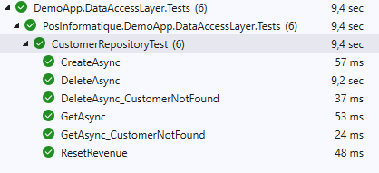
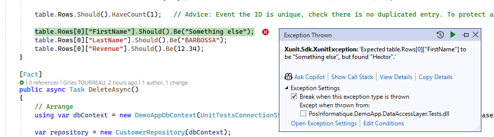
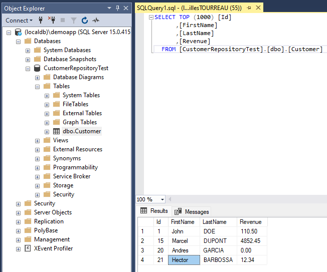

# Write unit tests to test the Data Access Layer

This section explain how to write the unit tests to test a Data Access Layer. The code samples
used here can be found in the [PosInformatique.UnitTests.Databases.Samples](../samples/PosInformatique.UnitTests.Databases.Samples.sln) solution inside the `samples` directory of the repository.

In this section we will test a repository called `CustomerRepository` inside a project called `DemoApp.DataAccessLayer`:

```csharp
public class CustomerRepository
{
    private readonly DemoAppDbContext dbContext;

    public CustomerRepository(DemoAppDbContext dbContext)
    {
        this.dbContext = dbContext;
    }

    public async Task CreateAsync(Customer customer)
    {
        await this.dbContext.Customers.AddAsync(customer);

        await this.dbContext.SaveChangesAsync();
    }

    public async Task DeleteAsync(int id)
    {
        var customerFound = await this.dbContext.Customers.SingleOrDefaultAsync(c => c.Id == id);

        if (customerFound is null)
        {
            throw new CustomerNotFoundException($"No customer found with the '{id}' identifier.");
        }

        this.dbContext.Customers.Remove(customerFound);

        await this.dbContext.SaveChangesAsync();
    }

    public async Task<Customer> GetAsync(int id)
    {
        var customerFound = await this.dbContext.Customers.SingleOrDefaultAsync(c => c.Id == id);

        if (customerFound is null)
        {
            throw new CustomerNotFoundException($"No customer found with the '{id}' identifier.");
        }

        return customerFound;
    }

    public async Task ResetRevenueAsync()
    {
        await this.dbContext.Customers.ExecuteUpdateAsync(c => c.SetProperty(e => e.Revenue, 0));
    }
}
```

Which use the following `DbContext` implementation:

```json
public class DemoAppDbContext : DbContext
{
    public DemoAppDbContext(DbContextOptions<DemoAppDbContext> options)
        : base(options)
    {
    }

    public DbSet<Customer> Customers => this.Set<Customer>();

    protected override void OnModelCreating(ModelBuilder modelBuilder)
    {
        modelBuilder.Entity<Customer>(entity =>
        {
            entity.ToTable("Customer");

            entity.HasKey(e => e.Id);

            entity.Property(e => e.Id)
                .UseIdentityColumn();
            entity.Property(e => e.FirstName)
                .HasColumnType("varchar(50)");
            entity.Property(e => e.LastName)
                .HasColumnType("varchar(50)");
            entity.Property(e => e.Revenue)
                .HasColumnType("decimal(10, 2)");
        });
    }
}
```

## Create the SQL Server instance

Before writing and executing the unit tests for a Data Access Layer, an instance of SQL Server is required.
You can use the following approaches:
- Using LocalDB instance (installed with Visual Studio). No setup is required for the developers on their machine, this is the easy approach recommanded.
- Using SQL Server Express or SQL Server Developer Edition instances. The developers will have to install manually this instance to their computer.
- Using a docker image of SQL Server. This approach is recommanded if you plan to execute your unit tests on Linux computers / servers.

### Create the LocalDB instance
If you want to use a LocalDB instance to execute your unit tests, execute the following command:

```cmd
sqllocaldb c <instance name>
```

With:
- `<instance name>`: The name of the instance to create. For example: `demoapp`.

## Create an unit tests project

To test the `CustomerRepository`, we create an `xUnit Test Project` in Visual Studio which reference our project that contains the
Data Access Layer to test.

By using xUnit, we will be able to use a feature called the `Class Fixture`. This xUnit feature allows the xUnit engine to create an instance
of the class and pass it in the constructor of the unit tests class each time an unit test (`Fact` method) is executed.

## Add the NuGet packages

In the test project, we add the [PosInformatique.UnitTests.Databases.SqlServer.EntityFramework](https://www.nuget.org/packages/PosInformatique.UnitTests.Databases.SqlServer.EntityFramework) NuGet package
package.

This package will allow to create database based on Entity Framework `DbContext` (The `DemoAppDbContext` in our example).

## Unit test class

The unit test class of our repository have to use a component called `SqlServerDatabaseInitializer`. This component contains
an `Initialize()` method which have to be called before each unit tests. The `Initialize()` method allows to create a database
based on Entity Framework `DbContext`.

The `SqlServerDatabaseInitializer` instance have to be instantiate only one time for all the unit tests of the class to execute.
For that, we will implements the `IClassFixture<SqlServerDatabaseInitializer>` for our unit test class and we will
retrieve the instance as parameter of the `CustomerRepositoryTest()` constructor.

```csharp
public class CustomerRepositoryTest : IClassFixture<SqlServerDatabaseInitializer>
{
    public CustomerRepositoryTest(SqlServerDatabaseInitializer initializer)
    {
        // Deploy the database using Entity Framework

        // Insert sample data for the Customer table.
    }
}
```

In the constructor of the `CustomerRepositoryTest` there are 2 stages to perform (which will be executed before each unit tests):
- Deploy a new instance of the database from a `DbContext`.
- Fill the tables which will be used by our unit tests.

> NB: To increase the speed of the execution of the unit tests, the `SqlServerDatabaseInitializer.Initialize()` will create physically the database
at the first unit test execution, and will empty the data for the other unit tests.

### Deploy a new instance of the database from a DbContext

To deploy a new instance of the database:
- Creates an instance of the `DbContext` which contains the Entity Framework model that will be use to create the schema of the database.
- Call the `SqlServerDatabaseInitializer.Initialize(DbContext)` with the instance of the DbContext previously instantiated.
- The `SqlServerDatabase` value returned by a `SqlServerDatabaseInitializer.Initialize(DbContext)` should be stored inside ass private member of the unit tests class.
  This `SqlServerDatabase` will allows to initialize data on the database and can be used in the unit tests to performs some SQL query to assert the tests.

```csharp
[Collection(DatabaseName)]
public class CustomerRepositoryTest : IClassFixture<SqlServerDatabaseInitializer>
{
    private const string DatabaseName = nameof(CustomerRepositoryTest);

    private readonly SqlServerDatabase database;

    public CustomerRepositoryTest(SqlServerDatabaseInitializer initializer)
    {
        // Deploy the database using Entity Framework
        using var dbContext = new DemoAppDbContext(UnitTestsConnectionStrings.CreateDbContextOptions<DemoAppDbContext>(DatabaseName));

        this.database = initializer.Initialize(dbContext);
    }
}
```

The `UnitTestsConnectionStrings` class is just a simple helper class in the unit tests projects which allows to centralize
the connection string and the `DbContextOptions` building.


```csharp
public static class UnitTestsConnectionStrings
{
    public static DbContextOptions<TContext> CreateDbContextOptions<TContext>(string databaseName)
        where TContext : DbContext
    {
        var optionsBuilder = new DbContextOptionsBuilder<TContext>()
            .UseSqlServer($"Data Source=(localdb)\\DemoApp; Initial Catalog={databaseName}; Integrated Security=True");

        return optionsBuilder.Options;
    }
}
```

> NB: We recommand to create this kind of helper which allows to change easily the connection string
depending of the SQL Server instance your target. It is also very useful if you plan to execute the unit tests
in a CI process (Git Actions, Azure Pipelines,...).

### Parallelism execution of the unit tests

By default, with XUnit all the unit tests will be executed in parallel. Also, our unit tests in the `CustomerRepositoryTest`
will works on the same database. It will not work of course, so it is mean that our unit tests must be executed in series
and not in parallel.

For that, we must add the `Collection` attribute with an unique name to indicate to XUnit that all the unit tests
in the class, must not be executed in parallel.

We recommand to put the name of the database in the arguments of the `Collection` attribute.

If you plan to write unit tests for different repositories, do not hesitate to use differents databases (we recommand to use the name of the repository tested).
Using this approach will allows to execute all the unit tests of a class in series, but will allows to execute the unit tests of differents repositories
in parallel.

```csharp
[Collection(DatabaseName)]
public class CustomerRepositoryTest : IClassFixture<SqlServerDatabaseInitializer>
{
    private const string DatabaseName = nameof(CustomerRepositoryTest);

    ...
}
```

### Initializes the data of the database

Remember that before each unit tests execution, the database is created with the schema of the materialized by the `DbContext`
and no data is present in the tables.

After initialize the database, insert the data using a `INSERT INTO` SQL command. The
[PosInformatique.UnitTests.Databases.SqlServer](https://www.nuget.org/packages/PosInformatique.UnitTests.Databases.SqlServer)
library provides an helper `InsertInto()` method on the `SqlServerDatabase` which allows to insert data based on a simple .NET class.
Each property of this class represents a column, the instance of this class represents the rows value to insert.

For example, to insert a `Customer` row in our database we just have to call the `InsertInto()` like the following example:

```csharp
this.database.InsertInto("Customer", new { FirstName = "John", LastName = "DOE", Revenue = 110.50 });
```

If the table contains an IDENTITY columns, the value will be automatically incremented by SQL Server. For the unit tests,
it is recommand to specify explicitly the IDENTITY value to avoid to updates the unit tests if one day you add/delete some
rows in the initialization of the data.

For that, the second argument of the `InsertInto()` method is boolean `disableIdentityInsert` which allows to indicate
if the IDENTITY auto-incrementation have to be disabled or enabled. By default this value is `false`.

To insert a customer with an explicit ID, define the `disableIdentityInsert` to `true` and specify explicitely the id of the customer
by adding an `ID` property.

```csharp
this.database.InsertInto("Customer", disableIdentityInsert: true, new { Id = 10, FirstName = "John", LastName = "DOE", Revenue = 110.50 });
```

It is also possible to simplify the code and the read-ability of the `InsertInto()` method by creating extensions methods
with parameters that contains the columns values to insert.

For example, the following `InsertCustomer()` extension method allows to insert a `Customer` in the database:

```csharp
public static class DemoAppDatabaseExtensions
{
    public static void InsertCustomer(this SqlServerDatabase database, int id, string firstName, string lastName, decimal revenue = 0)
    {
        database.InsertInto("Customer", true, new
        {
            Id = id,
            FirstName = firstName,
            LastName = lastName,
            Revenue = revenue,
        });
    }
}
```

With this extension method, we can now insert a row in the `Customer` table easily:

```csharp
this.database.InsertCustomer(id: 10, firstName: "John", lastName: "DOE");
```

In the end, if we want to insert 3 `Customer` rows in the database, the `CustomerRepositoryTest` constructor should look like this code:

public CustomerRepositoryTest(SqlServerDatabaseInitializer initializer)
{
    using var dbContext = new DemoAppDbContext(UnitTestsConnectionStrings.CreateDbContextOptions<DemoAppDbContext>(DatabaseName));

    this.database = initializer.Initialize(dbContext);

    this.database.InsertCustomer(id: 10, firstName: "John", lastName: "DOE", revenue: 110.50);
    this.database.InsertCustomer(id: 15, firstName: "Marcel", lastName: "DUPONT", revenue: 4852.45);
    this.database.InsertCustomer(id: 20, firstName: "Andres", lastName: "GARCIA");
}

Now, every time we will execute an unit test in the `CustomerRepositoryTest` class,
a database will be deployed with these 3 `Customer` before the execution of the unit test.

## Write the unit tests for methods that retrieve data

This section describes how to write an unit test for methods that retrieve data (SELECT queries).
By respecting the Arrange/Act/Assert pattern, the unit test will peform the following things:

- Arrange: Prepare the `DbContext`, the repository to test and the parameters of the method to call.
- Act: Call the method that retrieve the data in the database.
- Assert: The content of the business entity returned by the method must be assert.

In our `CustomerRepository` class, if we want to test the `GetAsync()` method, we have to write the unit code like that:

```csharp
[Fact]
public async Task GetAsync()
{
    // Arrange
    using var dbContext = new DemoAppDbContext(UnitTestsConnectionStrings.CreateDbContextOptions<DemoAppDbContext>(DatabaseName));

    var repository = new CustomerRepository(dbContext);

    // Act
    var customer = await repository.GetAsync(15);

    // Assert
    customer.Id.Should().Be(15);
    customer.FirstName.Should().Be("Marcel");
    customer.LastName.Should().Be("DUPONT");
    customer.Revenue.Should().Be(4852.45M);
}
```

Remember that in the previous section, in the constructor of the unit test class, a set of `Customer` are always inserted in the database.
In our case, we use the `Customer` with the `ID` define to `15`.

## Write the unit tests for methods that update the data

This section describes how to write an unit test for methods the update data (INSERT, UPDATE, DELETE, ... commands).
By respecting the Arrange/Act/Assert pattern, the unit test will peform the following things:

- Arrange: Prepare the `DbContext`, the repository to test and the parameters of the method to call.
- Act: Call the method that update  the data in the database.
- Assert: Query the tables in the database and assert the content of it.

In our `CustomerRepository` class, if we want to test the `CreateAsync()` method, we have to write the unit code like that:

```csharp
[Fact]
public async Task CreateAsync()
{
    // Arrange
    using var dbContext = new DemoAppDbContext(UnitTestsConnectionStrings.CreateDbContextOptions<DemoAppDbContext>(DatabaseName));

    var repository = new CustomerRepository(dbContext);

    var customer = new Customer("Hector", "BARBOSSA")
    {
        Revenue = 12.34M,
    };

    // Act
    await repository.CreateAsync(customer);

    // Assert
    var table = this.database.ExecuteQuery($"SELECT * FROM Customer WHERE Id = '{customer.Id}'");

    table.Rows.Should().HaveCount(1);

    table.Rows[0]["FirstName"].Should().Be("Hector");
    table.Rows[0]["LastName"].Should().Be("BARBOSSA");
    table.Rows[0]["Revenue"].Should().Be(12.34);
}
```

> **NB**: Please stop to contact me about "possible SQL Injection" in my samples code. The SQL code executed
in the `ExecuteQuery()` is executed only in the unit tests and will never be compiled for the production code!!!

In this unit test, we call the `CreateAsync()` method with the `Customer` to insert
in the database. In the `Assert` stage, we use the `ExecuteQuery()` helper method on the `SqlServerDatabase`
initialized which allows to retrieve the raw SQL data of the customer inserted.

The `ExecuteQuery()` returns an instance of a `DataTable` which allows the developers
to performs assertion of the raw SQL values (rows / columns).

> **Advice**: Developers should test only the "raw" values in the SQL Server table.
Don't use Entity Framework or other framework / helper (even Dapper) and don't wrap the results inside a complex .NET class.
The main goal of this kind of unit tests, is to assert that the contains of the table
match perfecly what the `CreateAsync()` should do.

## Execute the unit tests

To execute the units, it is very simple, just use your favorite unit tests runner, the Test Explorer in Visual Studio for example,
and run the unit tests:



You will remarks in the previous screenshot, that the execution of one the unit tests is around *10 sec* and the other unit tests
are executed very faster. This is because the first unit test executed create the database and initialize the schema, the other
unit tests clean the database before their execution, which is most faster.

### Check the database state after an unit test has been failed

When executing an unit test, if this one failed, developers can check the content of the database.
This behavior is possible, because the data are not clean after the execution of the unit tests, but only **before** execution the unit test.

For exemple, if we have a wrong assertion raised by Visual Studio:


Developers can check the content of the `Customer` table with SQL Server Management Studio (even during the debugger is locked on the exception!):

